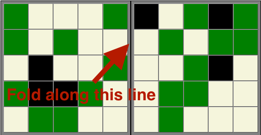

# Codenames Duet Card Generator
Generates a set of key cards for use with Codenames Duet. 

## How to use
Install.
```
npm install
```
Generate values for fifty unique random cards to a JSON file.
```
npm run save-deck
```
Open `src/index.html` in a browser for a print-ready version of the cards. The cards are designed to be printed single-sided and folded over the center line to make the card faces match up. 

